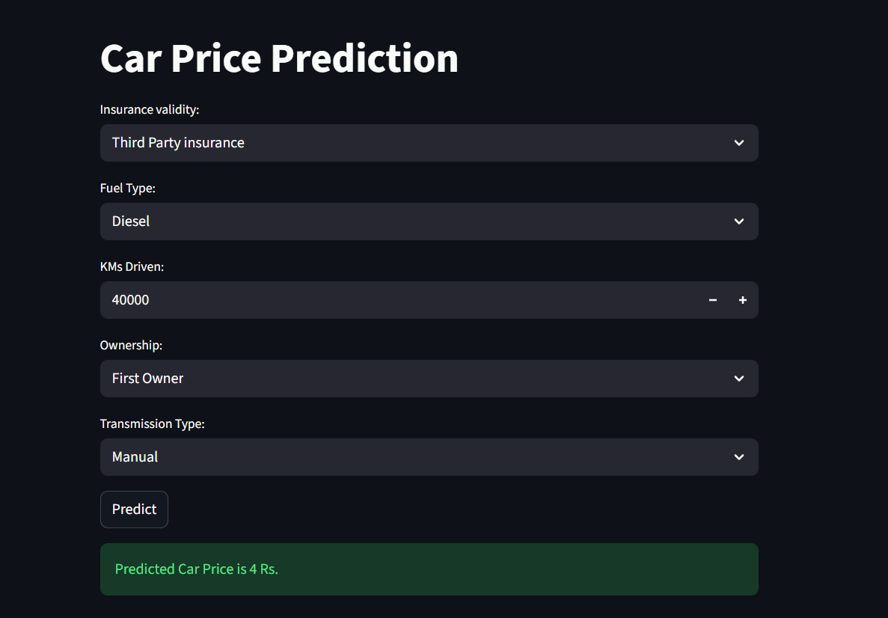

# Car Price Prediction Model



This project is a Machine Learning based application that predicts the price of a used car based on several features like insurance validity, fuel type, kilometers driven, ownership type, and transmission type. The project includes a Jupyter Notebook for data exploration, preprocessing, and model training, and a Streamlit web application for an interactive user interface.

## Project Structure

- `Car Dataset Processed.csv`: The dataset used for training the model.
- `models.ipynb`: A Jupyter Notebook containing data preprocessing steps, exploratory data analysis, and the training of multiple regression models (Linear Regression, KNN, SVR, etc.).
- `app.py`: A Streamlit script that provides a web-based user interface for predicting car prices.
- `model.pkl` / `final_model.pkl`: Serialized pre-trained machine learning models used by the app to make predictions.
- `columns.pkl`: Serialized column names to ensure the input data aligns perfectly with the model's expected format.

## How It Was Done

### 1. Jupyter Notebook (`models.ipynb`)
The machine learning pipeline was developed in the Jupyter Notebook:
- **Data Loading:** The dataset `Car Dataset Processed.csv` was loaded using `pandas`.
- **Data Preprocessing:** Various features were explored and transformed. Categorical variables like `insurance_validity`, `fuel_type`, `ownsership`, and `transmission` were mapped to numerical values or one-hot encoded. Date variables like `registration_year` were cleaned to calculate the `car_age`.
- **Model Training:** Features (`X`) and the target variable (`y` = `price(in lakhs)`) were defined. Several regression models from `scikit-learn` (such as Linear Regression, KNeighborsRegressor, SVR) were tested to find the best fit.
- **Serialization:** The best model and the required column structures were exported as `.pkl` files (`model.pkl` and `columns.pkl`) using the `pickle` library.

### 2. Streamlit Web App (`app.py`)
The Streamlit application provides an intuitive GUI:
- It loads the pre-trained model and column structure using `pickle`.
- It displays input fields (`selectbox`, `number_input`) for users to enter details of the car they want to predict the price for.
- When the user clicks **Predict**, the input values are converted into a Pandas DataFrame, categorical variables are encoded via `pd.get_dummies()`, and columns are reindexed to match the model's training data.
- The model makes a prediction and the estimated price is displayed on the screen.

## How to Launch the App

To run the Streamlit app locally on your machine, follow these steps:

1. **Clone the repository:**
   ```bash
   git clone https://github.com/DA-Shaurya/Car_Price_Prediction_Model.git
   cd Car_Price_Prediction_Model
   ```

2. **Install the required dependencies:**
   Make sure you have Python installed, then install the required packages. You can run:
   ```bash
   pip install streamlit pandas scikit-learn
   ```

3. **Run the Streamlit application:**
   Launch the app by executing the following command in your terminal:
   ```bash
   streamlit run app.py
   ```

4. **View the app:**
   The application will automatically open in your default web browser (usually at `http://localhost:8501`).
